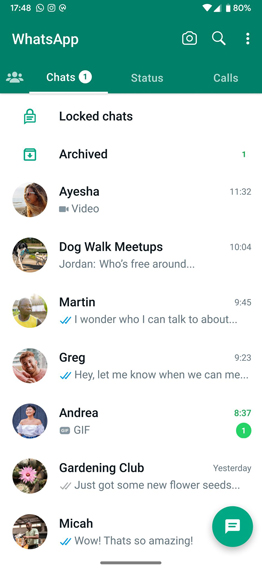

# Lazy Layouts: Lección 1

Con los conceptos que hemos aprendido ya somos capaces de armar al menos en gran medida una interfaz parecida a la de la imagen.

Te proponemos lo siguiente:

1. Crear una clase que me permita almacenar los datos básicos de una "Conversación" de una app de mensajería. Estos datos básicos son: Contacto y Mensajes. Contacto deberá ser también una clase por si misma que contenga una imagen de perfil y un nombre. Para facilitar el ejercicio, asumamos que esa "imagen de perfil" pueda ser el identificador de un drawable en los recursos de la app.(Esto lo hablamos en clase, pero por si te lo perdiste, podemos almacenar imágenes png en la carpeta *res/drawable* y utilizarlas en nuestra app. Por ejemplo: almaceno una imagen llamada img_avatar_01, y luego puedo hacer referencia a ella en mi código a través del identificador R.drawable.img_avatar_01).Mensaje también deberá ser una clase por si misma, conteniendo por un lado el mensaje en sí mismo, y por otro la fecha en que fue recibido. (A los efectos de este práctico podrás asumir que esa fecha es simplemente un String, pero mejor aún si usamos la clase de fecha correspondiente).
2. Crear un elemento de UI que muestre un elemento como los que vemos en la imagen, populando los campos con la imagen de perfil del contacto, el nombre del mismo, el texto del último mensaje, y la fecha de recibido de ese mismo mensaje.
3. Mostrar en pantalla un listado en el que se puedan visualizar todas las conversaciones dentro de una *list* llamada **conversationsList** como se muestra en la imagen (obviar los demás elementos de la imagen).

**IMPORTANTE**: La lista de conversaciones con sus respectivos contactos y listado de mensajes las popularán ustedes, debiendo todas ellas tener más de un mensaje en la lista de mensajes.